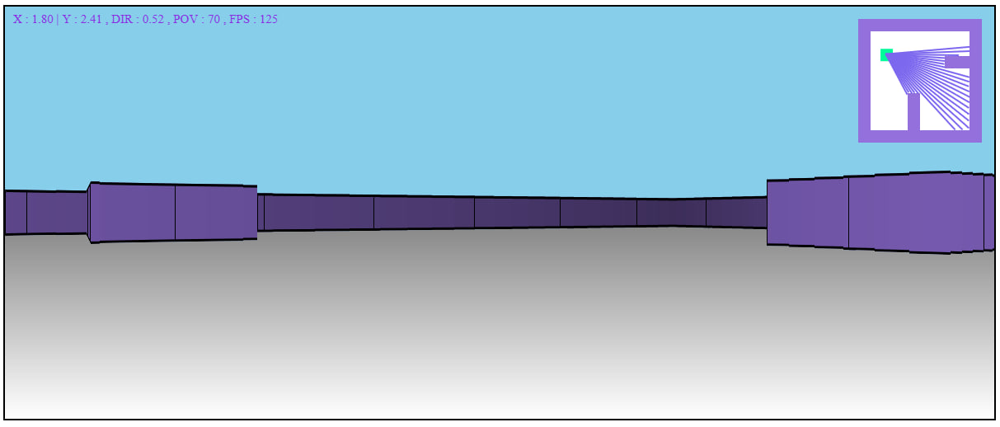

# Raycasting 3D Engine in JavaScript


A simple 3D raycasting renderer written in pure JavaScript and HTML Canvas, inspired by early FPS games like Wolfenstein 3D.



---

## Features

- Minimap with player direction
- Pseudo-3D wall rendering
- FPS display
- Wall darkening by distance
- Camera movement and rotation (WASD)
- Pure JavaScript without libraries

---

## Controls

**W** - forward movement<br>
**A** - left turn<br>
**S** - backward movement<br>
**D** - right turn<br>

---

## Launch

Clone the project and open `index.html` in the browser:

```bash
git clone https://github.com/ownNurzh/ray-casting-on-js-html.git
```

---

## License

This project is licensed under [MIT License](./LICENSE).

---

## Demo

[Demo](https://ownnurzh.github.io/ray-casting-on-js-html/)

---

# Author

[ownNurzh](https://github.com/ownNurzh)

---
